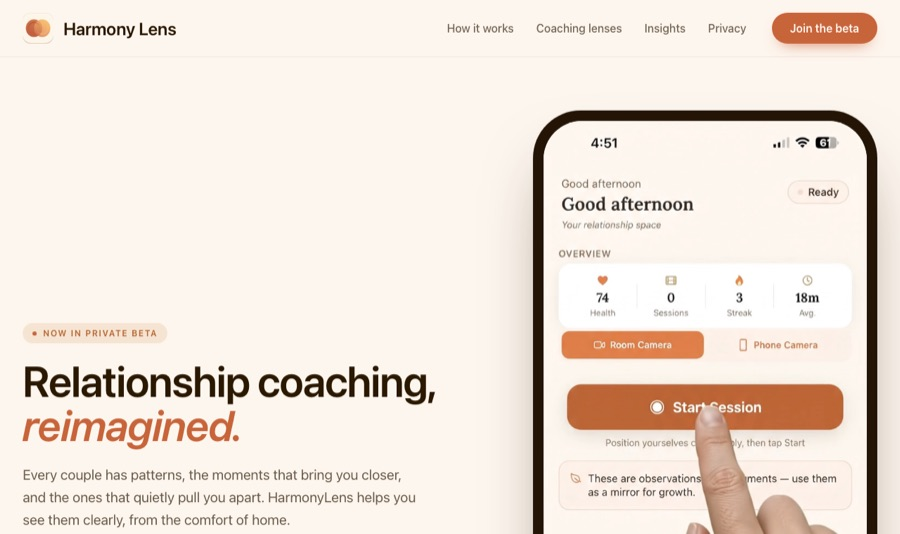
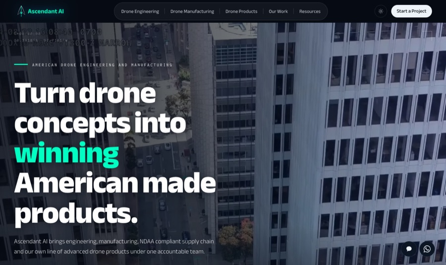
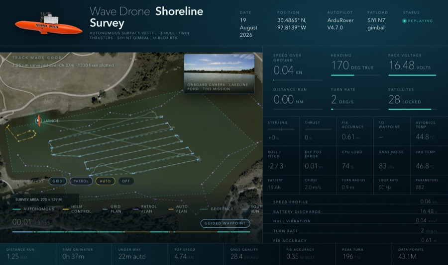

 

 

 

## About me

Full-Stack Software Engineer with 2 years of professional experience and a B.S. in Computer Engineering. At **Guinn Partners** I deliver what each product needs across web, mobile, desktop and hardware, from a Raspberry Pi device and its iOS app to a company website with an AI assistant and real-time telemetry tools. Before that I built REST APIs and dashboards for a production POS platform at **Ameza Solutions**.

 

## Featured work

<table>
<tr>
<td width="50%" valign="top">

### [HarmonyLens](https://harmonylens.app)
A hardware device plus iOS app, now in TestFlight beta. I built the Raspberry Pi unit (camera, microphone, speaker), a Node.js server that streams RTSP video and live audio over WebSocket, and the React Native app with live transcription, speaker diarization, Claude replies and ElevenLabs voice.

   
</td>
<td width="50%" valign="top">

### [Ascendant AI](https://ascndx.ai)
The company website for an American drone engineering and manufacturing firm, with an AI assistant built on the Anthropic Claude API, an enquiry flow and Leaflet maps. Covered by 155 automated tests.

    
</td>
</tr>
<tr>
<td width="50%" valign="top">

### Wave Drone mission replay
A 38-minute autonomous mission (43.1M logged values) replayed on an always-on office display. A Python pipeline turns ArduPilot logs into a satellite-map replay synced with the onboard camera.

  
</td>
<td width="50%" valign="top">

### Mission telemetry monitor
An Electron desktop app that reads probe telemetry from a serial port, charts it live and flags faulty sensors, plus a Python fault simulator for testing without hardware. 377 automated tests.

  

### Dashboard builder
Users build their own dashboards from any MongoDB data with no hard-coded schema: a drag-and-drop grid of up to 32 widgets on a Node.js and Express API that reads the database structure live.

  

Company work in private repositories.
</td>
</tr>
</table>

 

## Tech stack

  
   
  

Also: React Native (Expo), Playwright, React Testing Library, PHPUnit, Cypress, WebSocket, REST, Anthropic Claude API, Deepgram, AssemblyAI, Whisper, ElevenLabs

 

## Open source

| Project | What it is | Stack |
|---|---|---|
| [Stock Management App](https://github.com/yldzozgur/stock-management-app) · [live](https://ozguryildiz-stock.vercel.app) | Inventory and sales platform with role-based permissions | React · Redux Toolkit · Express · MongoDB |
| [React Movie App](https://github.com/yldzozgur/react-movieapp) · [live](https://yldzozgur.github.io/react-movieapp/) | Movie discovery app with Firebase sign-in | React · Firebase · TMDB API |

 

**Open to full-stack and backend roles in Austin, hybrid or remote.**
Authorized to work in the U.S., no sponsorship required.

